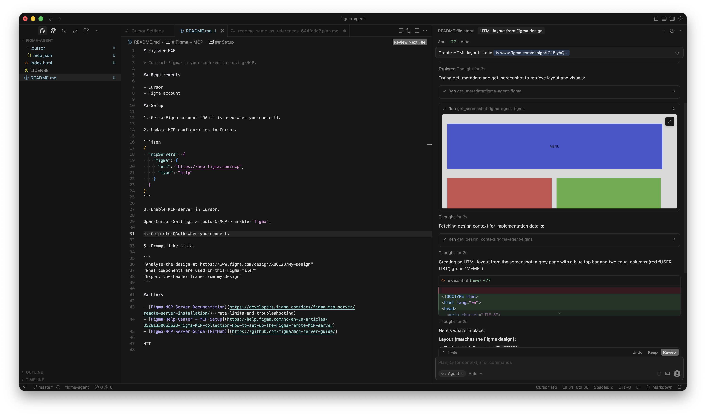

# Figma + MCP

> Control Figma in your code editor using MCP.

## Requirements

- Cursor
- Figma account

## Setup

1. Get a Figma account (OAuth is used when you connect).

2. Update MCP configuration in Cursor.

```json
{
  "mcpServers": {
    "figma": {
      "url": "https://mcp.figma.com/mcp",
      "type": "http"
    }
  }
}
```

3. Enable MCP server in Cursor.

Open Cursor Settings > Tools & MCP > Enable `figma`.

4. Complete OAuth when you connect.

5. Prompt like ninja.

```
"Analyze the design at https://www.figma.com/design/ABC123/My-Design"
"What components are used in this Figma file?"
"Export the header frame from my design"
```

## Demo



## Links

- [Figma MCP Server Documentation](https://developers.figma.com/docs/figma-mcp-server/remote-server-installation/) (rate limits and troubleshooting)
- [Figma Help Center - MCP Setup](https://help.figma.com/hc/en-us/articles/35281350665623-Figma-MCP-collection-How-to-set-up-the-Figma-remote-MCP-server)
- [Figma MCP Server Guide (GitHub)](https://github.com/figma/mcp-server-guide/)
